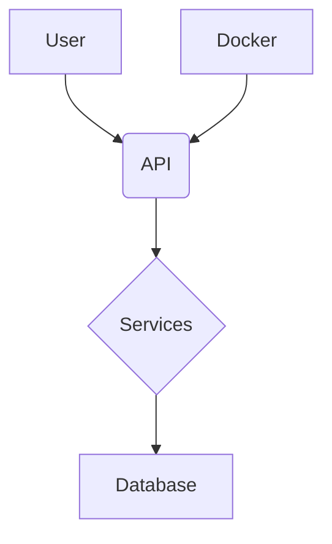

# Project Architecture

This flowchart depicts the interaction between the different elements of the project.

```mermaid
graph TD
    A[User] --> B(API);
    B --> C{Services};
    C --> D[Database];
    E[Docker] --> B;
```
